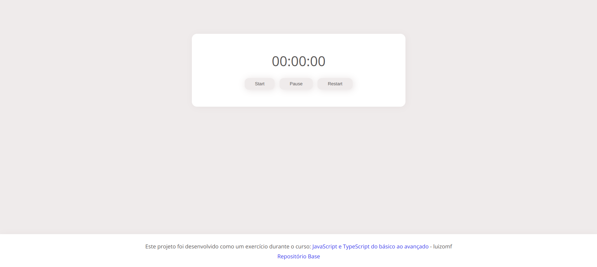

# Basic Timer

## Descrição
Um timer básico com botões para Start, Pause e Restart. Esse projeto foi desenvolvido como um exercício durante o curso [JavaScript e TypeScript do básico ao avançado](https://www.udemy.com/course/curso-de-javascript-moderno-do-basico-ao-avancado/learn/lecture/16342392?start=0#overview), do professor Luiz Otávio Miranda.

## Repositório Pai
https://github.com/alemobn/study-javascript-luizomf